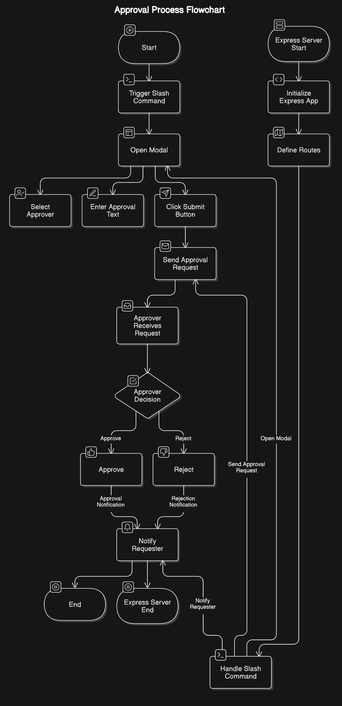

# Slack Approval Bot Setup
This README provides instructions for setting up and running a Slack approval bot using Express.js. The bot allows users to request approvals through a slash command and handles interactive responses.
## Architecture Diagram

## Prerequisites
- Node.js and npm installed
- A Slack workspace where you have permissions to add apps
- Basic understanding of Express.js
## Slack App Configuration
1. Go to [https://api.slack.com/apps](https://api.slack.com/apps) and select your "test-bot" app.
2. Under "Basic Information":
   - Note down your "Signing Secret" for the SLACK_SIGNING_SECRET environment variable
3. Under "OAuth & Permissions":
   - Add the following bot token scopes:
     - chat:write
     - commands
     - users:read
   - Install the app to your workspace
   - Note down the "Bot User OAuth Token" for the SLACK_BOT_TOKEN environment variable
4. Under "Slash Commands", create a new command:
   - Command: /approval-test
   - Request URL: https://your-app-url.com/slack/commands/approval-test
   - Short Description: "Request approval"
   - Usage Hint: "[request details]"
5. Under "Interactivity & Shortcuts":
   - Turn on Interactivity
   - Set the Request URL to: https://your-app-url.com/slack/interactions
6. Under "Event Subscriptions":
   - Turn on Enable Events
   - Set the Request URL to: https://your-app-url.com/slack/events
## Project Setup
1. Clone the repository and install dependencies:
bash
git clone <repository-url>
cd slack-approval-bot
npm install

2. Install required dependencies:
bash
npm install express dotenv @slack/events-api

3. Create a .env file in your project root:

SLACK_SIGNING_SECRET=your_signing_secret_here
SLACK_BOT_TOKEN=xoxb-your_bot_token_here
PORT=3000

## Server Structure
The main server file (server.js) sets up an Express application with the following endpoints:
- /slack/events: Handles Slack events
- /slack/commands/approval-test: Processes slash commands
- /slack/interactions: Handles interactive components
- /health: Health check endpoint
## Running the Server
1. Development mode:
bash
npm run dev

2. Production mode:
bash
npm start

The server will start on the port specified in your .env file (defaults to 3000).
## Important Points
- Ensure all environment variables are properly set before running the server
- The server needs to be accessible via HTTPS for Slack to send requests
- Keep your signing secret and bot token secure
- Monitor the server logs for any errors or issues
- The bot requires proper error handling for production use
## Endpoints
- POST /slack/commands/approval-test: Handles the slash command
- POST /slack/interactions: Processes button clicks and other interactive elements
- GET /health: Returns server health status
- POST /slack/events: Handles Slack events

## Troubleshooting
If you encounter issues:
1. Check that all environment variables are set correctly
2. Verify your Slack app configurations
3. Ensure your server is accessible via HTTPS
4. Check server logs for error messages
5. Verify that all required scopes are added to your Slack app
## Support
For additional help:
- Check Slack's [API documentation](https://api.slack.com/docs)
- Review the Express.js [documentation](https://expressjs.com/)
- Contact your system administrator for deployment-related issues write this in markdown language